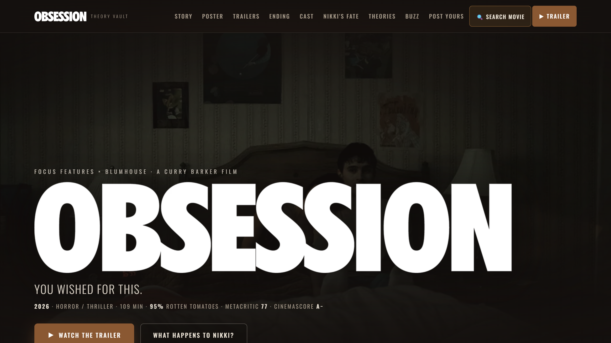
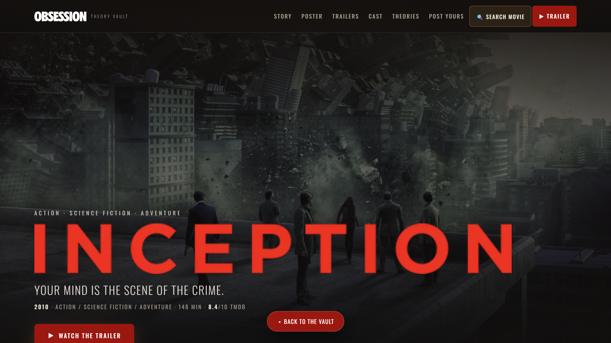
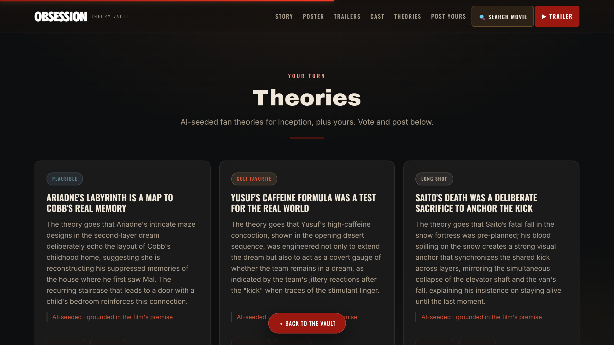

<div align="center">

# 🎬 The Film Theory Vault

### Search any movie. Get a cinematic, auto‑themed page with AI‑written fan theories you can vote on.

[](https://film-theory-vault.vercel.app)
[](https://vercel.com)
[](https://www.themoviedb.org/)
[](https://groq.com/)
[](LICENSE)

<br />



</div>

## The story behind it

It started as a fan‑theory hub for the 2025 horror film **_Obsession_** (Curry Barker · Focus Features × Blumhouse), built on a **phone** the evening after the screening. It got out of hand and turned into a **search‑any‑movie engine**: type in any film and the whole page regenerates in the same cinematic style, with real data and AI‑generated theories.

**Live:** **https://film-theory-vault.vercel.app**

## ✨ Features

- 🎨 **Search any movie** — real poster, backdrop, cast and trailers from TMDB, and the entire site **repaints to the movie's own palette** (Inception turns red, The Matrix turns green) via client‑side canvas colour extraction.
- 🤖 **AI theory agent** — runs each film through an LLM (Groq `openai/gpt-oss-120b`) that writes **scene‑anchored** fan theories, not generic filler, with a trope‑reject filter and safety guardrails. Vote on them and post your own.
- 🔒 **Airtight spoiler gate** — the ending recap and fate breakdown sit behind an opt‑in click and are served from a `noindex` endpoint, so they never appear in the page source, Ctrl+F, screen readers, or crawlers until you choose to reveal them.
- 🔥 **Trending Vaults** — a live homepage rail of what's trending and in theatres now (TMDB), each clickable into its own vault.
- 🛡️ **Hardened** — per‑request **nonce CSP** (no `unsafe-inline` scripts), full security‑header suite, server‑side HTML escaping on every interpolated string, adult‑content block, and rate‑limited proxies.
- 🔍 **Per‑movie SSR + SEO** — a server‑rendered `<noscript>` body, a generated **Movie JSON‑LD** block, and per‑movie OG / canonical tags for every film, so shared links preview correctly and no‑JS visitors still see the right movie.
- ♿ **Accessible** — skip‑link, landmarks, live‑region announcements, `role="meter"` odds with full ARIA, a no‑JS floor, and WCAG 2.2 AA contrast.

## 📸 Screenshots

**Search any movie — the page auto‑themes to it**



**An AI reads the film and writes scene‑anchored theories**



## 🧱 How it works

One static `app.html` plus a handful of Vercel serverless functions. **No framework, no build step.**

```
app.html          The entire UI + client engine, in a single file
api/tmdb.js       TMDB proxy (key stays server-side): search · movie bundle · trending · now_playing
api/theories.js   AI theory agent — gpt-oss-120b -> llama-3.3-70b -> 8b fallback chain, trope filter, safety net
api/page.js       Per-movie SSR — swaps <head> OG/JSON-LD/canonical, injects a no-JS movie body, sets the nonce CSP
api/ending.js     Spoiler-gated payload (the recap + fate), fetched only after an opt-in click
vercel.json       Rewrites + security headers
```

The TMDB and Groq API keys live **only** in Vercel environment variables — never exposed to the client, never committed.

## 🛠️ Built with

- Vanilla **HTML / CSS / JS** in a single file (no framework)
- **Vercel** serverless functions (Node)
- **[TMDB API](https://www.themoviedb.org/)** for movie data and imagery
- **[Groq](https://groq.com/)** (`openai/gpt-oss-120b`) for theory generation
- Written with **[Claude Code](https://claude.com/claude-code)** — most of it on a phone

## 🚀 Run it locally

```bash
git clone https://github.com/vaibhav4046/film-theory-vault.git
cd film-theory-vault
cp .env.example .env
```

Add two keys (in `.env` for `vercel dev`, or in your Vercel project settings):

```bash
TMDB_API_KEY=your_tmdb_v3_key   # themoviedb.org/settings/api
GROQ_API_KEY=your_groq_key      # console.groq.com/keys
```

Then:

```bash
npm i -g vercel
vercel dev      # local dev server
vercel --prod   # deploy
```

## 🙏 Credits & disclaimer

This is an **unofficial, non‑commercial fan project**. _Obsession_ (2025) is a film by **Curry Barker**, **Focus Features** and **Blumhouse** — full respect to them. Movie data and images come from **[TMDB](https://www.themoviedb.org/)**; this product uses the TMDB API but is **not endorsed or certified by TMDB**. See [ATTRIBUTIONS.md](ATTRIBUTIONS.md).

Because some films covered here deal with heavy themes, the site keeps a crisis‑support line in the footer (Samaritans 116 123 · US 988 · [findahelpline.com](https://findahelpline.com)).

## 📄 License

[MIT](LICENSE) for the code. Movie data and images belong to their respective owners.

<br />

<div align="center">
Built with ❤️ and <a href="https://claude.com/claude-code">Claude Code</a> — most of it on a phone, the evening after the film.
</div>
